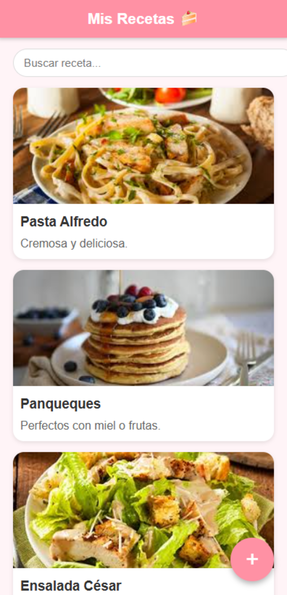
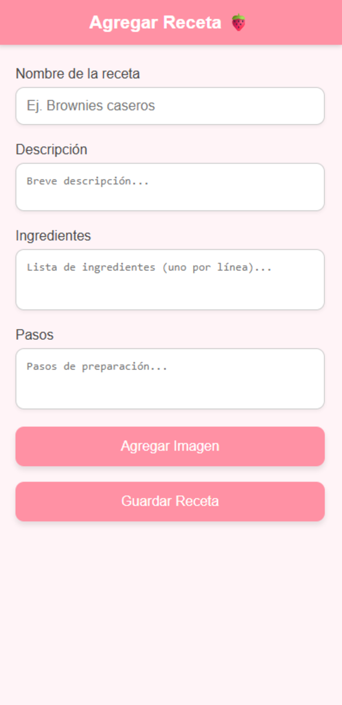
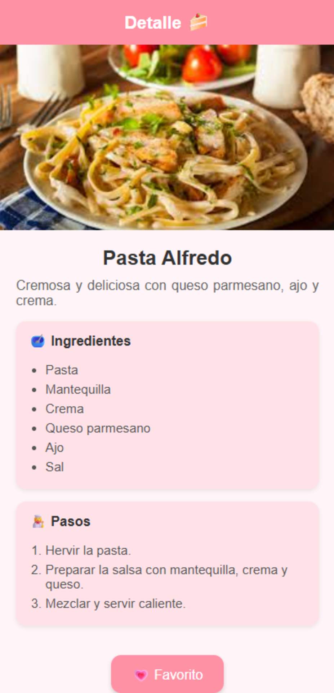
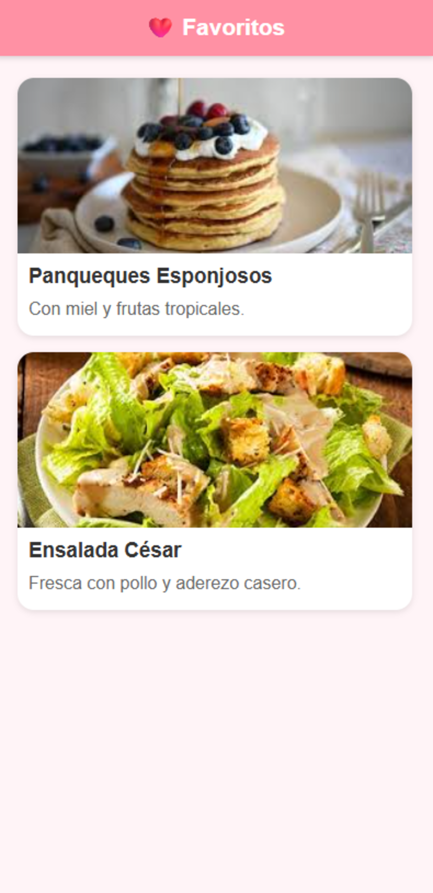

# 🍲 App de Recetas

### 🧾 Descripción del proyecto

Mi idea de proyecto es una **App de Recetas**
La aplicación permite **ver, agregar y guardar recetas de cocina**, mostrando una lista con imagen, nombre y descripción.  
Cada receta puede incluir su foto, lista de ingredientes y pasos de preparación.  
El usuario también puede **buscar recetas** por nombre y **marcarlas como favoritas** para acceder fácilmente después.  

---

## 📱 Mockups de la aplicación

Los siguientes mockups representan las pantallas principales que tendrá la aplicación.  
Están creados con diseño tipo móvil y se ubican dentro de la carpeta `/Mockups`.

### 🏠 Pantalla principal – Lista de Recetas
Muestra las recetas guardadas con imagen, nombre y descripción.
  
**Archivo de imagen:** `mockup_lista_recetas.png`

---

### ➕ Pantalla – Agregar Receta
Formulario para registrar una nueva receta con nombre, descripción, ingredientes y pasos.

**Archivo de imagen:** `mockup_agregar_receta.png`

---

### 🍳 Pantalla – Detalle de Receta
Muestra la información completa de una receta, con su foto, ingredientes y pasos en cuadros redondeados.

**Archivo de imagen:** `mockup_detalle_receta.png`

---

### ❤️ Pantalla – Favoritos
Lista con las recetas marcadas como favoritas por el usuario.

**Archivo de imagen:** `mockup_favoritos.png`

---